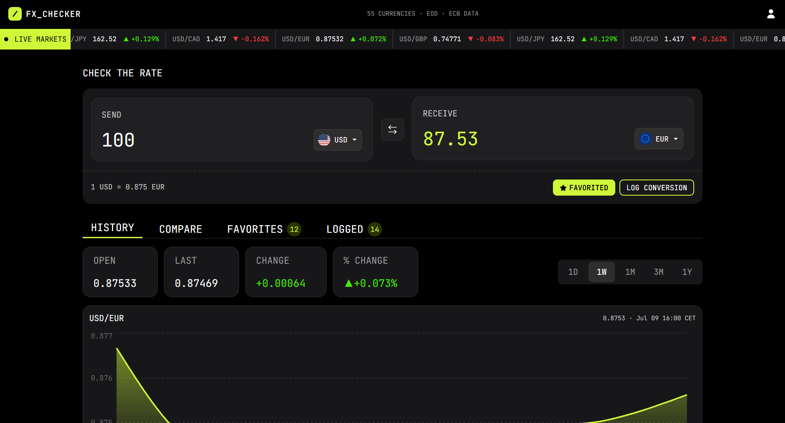

# Frontend Mentor - FX Checker solution

This is a solution to the [FX Checker challenge on Frontend Mentor](https://www.frontendmentor.io/challenges/foreign-exchange-currency-converter). Frontend Mentor challenges help you improve your coding skills by building realistic projects.

## Table of contents

- [Overview](#overview)
  - [The challenge](#the-challenge)
  - [Screenshot](#screenshot)
  - [Links](#links)
- [My process](#my-process)
  - [Built with](#built-with)
  - [What I learned](#what-i-learned)
  - [Continued development](#continued-development)
  - [AI Collaboration](#ai-collaboration)
- [Author](#author)

## Overview

### The challenge

Your users should be able to:

#### Converter

- Enter an amount to send and see it convert in real time as they type
- Pick the "send" and "receive" currencies from a searchable currency picker
- See the live exchange rate for the active pair (for example, `1 USD = 0.8530 EUR`)
- Swap the send and receive currencies with the swap button
- Favorite the active pair, and log a conversion to their history

#### Currency picker

- Search the full list of available currencies by code or name
- See currencies grouped into "Popular" and "Other currencies", each row showing the flag, code, and name
- See a check against the currency that's currently selected

#### Live markets ticker

- See a ticker of currency pairs, each with its current rate and 24-hour change (up or down)

#### Rate history

- View a line and area chart of the active pair's rate over time
- Switch the chart range between 1D, 1W, 1M, 3M, 1Y, and 5Y
- See the open, last, absolute change, and percentage change for the selected range

#### Compare

- See their send amount converted into a range of other currencies at once, each with its reference rate
- Pin or unpin any comparison row to their favorites

#### Favorites

- See their pinned pairs, each with its live rate and 24-hour change
- Load a pinned pair back into the converter by selecting its row
- Unpin a pair they no longer want to track

#### Conversion log

- See a log of conversions they've made, each showing the relative time, the pair, and the send and receive amounts
- Clear the whole log
- Delete an individual entry

#### UI & accessibility

- View the optimal layout for the interface depending on their device's screen size
- See hover and focus states for all interactive elements on the page
- Navigate the entire app using only their keyboard

### Screenshot

### Links

- Solution URL: [Add solution URL here](https://github.com/denissoboslai13/frontend-mentor-FXChecker)
- Live Site URL: [Add live site URL here](https://frontend-mentor-fx-checker-eight.vercel.app/)

## My process

### Built with

- Semantic HTML5 markup
- CSS custom properties
- Flexbox
- CSS Grid
- Mobile-first workflow

Frontend:

- React
- Motion
- Axios

Backend:

- bcrypt
- express
- jwt
- mongoose db

### What I learned

Okay well this is by far the most complicated project ive ever done, but im happy with how it turned out. As a preface, i know this code isnt the cleanest, i MIGHT (emphasis on might) refactor the code to be as clean as possible, but thats maybe for another day, this is also running on render for the backend, and vercel for the frontend, which might cause some delays, or maybe even crashes, i am aware of this, but theres not much i can do! I already had full stack experience thanks to doing the Full stack open course, but it was very nice to refresh it with this project. Some new stuff i learned include:
Setting up backend stuff, apis, crud, and mainly sending back the correct data, with the correct code (i mostly knew this? but did need to reread some docs.). For the frontend i would say just got much better at working with data, specifically the frankfurter api data, and i dont think i will ever forget how first of all async await work, or how to map an array.

### Continued development

I would like to use this for my personal portfolio, because i think its a pretty good project for a junior dev. As for the stuff i learned / went over, its all pretty important so, definitely will use it in the future too.

### AI Collaboration

So i think in todays day and age its almost recommended to use AI, and i tend to use claude, but i would say 98% of the code was handwritten by me, or refactored from older projects. I mostly used claude for some repetetive tasks, like the currencies dictionary you might see in one or two of my components, or just some help with how certain ui ux components should work.

## Author

- Frontend Mentor - [@denissoboslai13](https://www.frontendmentor.io/profile/denissoboslai13)
